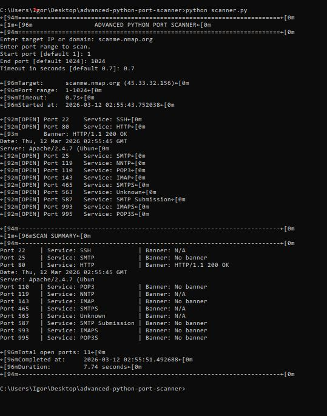

# 🛰️ Advanced Python Port Scanner


---

## 📌 Overview

The **Advanced Python Port Scanner** is a multithreaded network reconnaissance tool written in Python.

It scans TCP ports on a target host, identifies open services, and optionally retrieves service banners.

This project demonstrates practical networking and cybersecurity concepts such as:

- TCP socket communication
- port scanning techniques
- service detection
- banner grabbing
- multithreaded scanning

---

## ⚡ Features

✔ Multithreaded TCP port scanning  
✔ Service detection for common ports  
✔ Banner grabbing for supported services  
✔ Configurable port range  
✔ Adjustable scan timeout  
✔ Clean scan summary output  

---

## 🖥️ Example Scan

Example output from scanning a safe public test host.



---

## ⚙️ Installation

Clone the repository:

```bash
git clone https://github.com/supnrm02-cmd/Advanced-python-port-scanner.git
cd Advanced-python-port-scanner
```

(Optional) install dependencies:

```bash
pip install -r requirements.txt
```

---

## ▶️ How to Run

Run the scanner with:

```bash
python scanner.py
```

You will be prompted to enter scanning parameters.

Example:

```
Enter target IP or domain: scanme.nmap.org
Start port [default 1]: 1
End port [default 1024]: 1024
Timeout [default 0.7]: 0.7
```

---

## 📊 Example Output

```
[OPEN] Port 22   Service: SSH
[OPEN] Port 25   Service: SMTP
[OPEN] Port 80   Service: HTTP
[OPEN] Port 110  Service: POP3
[OPEN] Port 143  Service: IMAP
[OPEN] Port 443  Service: HTTPS
```

Scan summary:

```
Total open ports: 11
Scan duration: 7.74 seconds
```

---

## 📂 Project Structure

```
Advanced-python-port-scanner
│
├── scanner.py
├── services.py
├── requirements.txt
│
├── examples
│   └── scan_output.png
│
└── README.md
```

---

## 🧠 Skills Demonstrated

This project highlights practical cybersecurity and networking skills:

- Python socket programming
- TCP/IP networking fundamentals
- network reconnaissance
- service fingerprinting
- multithreaded application design
- CLI tool development

---

## ⚠️ Disclaimer

This tool is intended **for educational purposes only**.

Only scan systems that you own or have **explicit permission** to test.

Unauthorized port scanning may violate network policies or laws.


## ⭐ Support

If you found this project useful, consider **starring the repository** to support the project.

